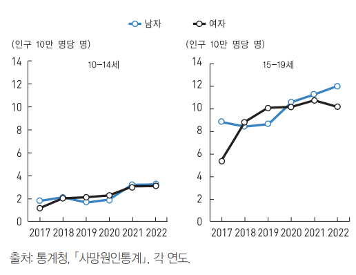

# 집가고싶다
## 팀 프로젝트 명
: 청소년 게이트 키퍼
### 프로젝트 명 선정 이유
'gate-keeper'의 사전적 의미는 '문지기'라는 뜻입니다. 청소년들과 국가(변경예정) 사이에 중간 다리 역할을 한다는 뜻으로 "청소년 게이트 키퍼"로 정하게 되었습니다.

## 팀 소개
| 이름 | 역할 | GitHub Profile |
|------|------|---------|
| 김민준 | 팀장 | @KIMsongeul |
| 최도은 | 부팀장 | @doeun07 |
| 구건모 | 프로그래머 | @rra30 |
| 정혜양 | 엔지니어 | @xom1p |

## 프로젝트 개발 이유
### 문제인식
</img>
대한민국의 학업 스트레스와 사회적 압박 등으로 청소년 자살률이 증가하고 있으며, 우울증을 겪으면서도 인지를 못하거나 인지를 하더라도 치료를 거부하는 경우가 많습니다.
이는 K-SDGs 목표 3: 모두를 위한 건강한 삶 보장 및 웰빙 증진, K-SDGs 목표 4: 포용적이고 공평한 양질의 교육 보장, K-SDGs 목표 11: 포용적이고 안전하며 지속 가능한 도시 조성이 지켜지지 않고 있다고 생각합니다.

### 프로젝트 개요
위와 같은 문제를 해결하기 위해서 상담센터를 직접 방문하지 않아도 쉽고 편하게 접근할 수 있는 사이트를 만들게 되었습니다.

<!-- 프로젝트 실행 방법은 개발이 모두 다 끝난 후 작성 -->