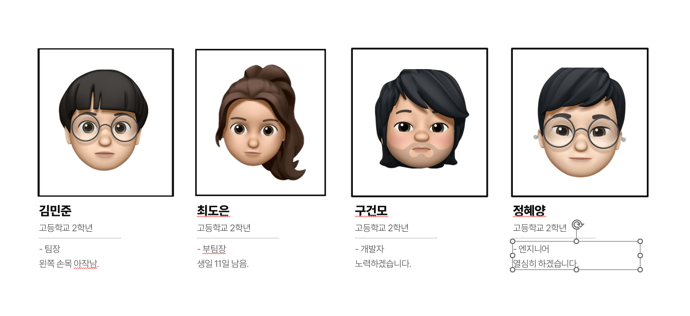
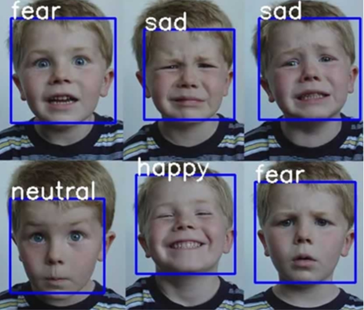

## 팀명 : 집가고싶다
### 팀원 소개
| 이름 | 역할 | GitHub Profile |
|------|------|---------|
| 김민준 | 팀장 | [@KIMsongeul](https://github.com/KIMsongeul)|
| 최도은 | 부팀장 | [@doeun07](https://github.com/doeun07) |
| 구건모 | 프로그래머 | [@rra30](https://github.com/rra30) |
| 정혜양 | 엔지니어 | [@xom1p](https://github.com/xom1p) |

</img>  

## 프로젝트 개발 이유
### 문제인식

대화와 표정 , 정서적 소통의 과정을 통해서 우리는 나와 타인을 이해하고 격려하고 응원할 수 있으며, 서로의 문제들을 해결할 수 있는 열쇠를 가질 수 있게 되는 것
K-SDGs 목표 3: 모두를 위한 건강한 삶 보장 및 웰빙 증진, K-SDGs 목표 4: 포용적이고 공평한 양질의 교육 보장, K-SDGs 목표 11: 포용적이고 안전하며 지속 가능한 도시 조성이 지켜지지 않고 있다고 생각합니다.

위와 같은 문제를 해결하기 위해서 상담센터를 직접 방문하지 않아도 쉽고 편하게 접근할 수 있는 사이트를 만들게 되었습니다.

## 프로젝트 개요
### 프로젝트 이름 : 청소년 게이트 키퍼
### 프로젝트 명 선정 이유
'gate-keeper'의 사전적 의미는 '문지기'라는 뜻입니다. 청소년들과 마음 사이에 중간 다리 역할을 한다는 뜻으로 "청소년 게이트 키퍼"로 정하게 되었습니다.
### 주요 기능 :
- 사용자 감정 인식 가능.  
</img>  
- Gemini-Bot을 활용하여 사이트에서 대화가 가능한 채팅 시스템

## 프로젝트 실행 방법
